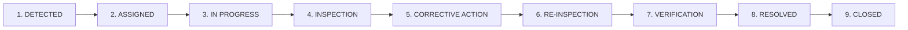

# SIH26024 — Case Management, Statutory SLA & Resolution Workflow

> **Platform:** CoalGov Smart Governance & Compliance Monitoring System
> **Standard:** Coal Mines Regulations (CMR) 2017 & DGMS Statutory Directives
> **Lifecycle Pipeline:** `DETECTED` → `ASSIGNED` → `IN_PROGRESS` → `INSPECTION` → `CORRECTIVE_ACTION` → `RE_INSPECTION` → `VERIFICATION` → `RESOLVED` → `CLOSED`

---

## 1. Statutory Case Lifecycle Overview

Every safety anomaly, environmental sensor spike, or unauthorized geofence breach follows an immutable 8-stage resolution sequence:

### Stage Definitions:
1. **DETECTED (`OPEN`):** Automated trigger from IoT sensor drift (e.g. Airflow < 3.0 m/s or CH4 > 0.75%) or manual field hazard report.
2. **ASSIGNED (`ASSIGNED`):** Colliery supervisor dispatches case to designated Shift Safety Officer (e.g. `Raj Kumar · M-1024`).
3. **IN PROGRESS (`IN_PROGRESS`):** Safety officer initiates underground physical triage and schedules mandatory inspection.
4. **FIELD INSPECTION (`INSPECTION_REQUIRED` / `INSPECTION_SUBMITTED`):** Physical condition assessed in the field; geo-tagged observations and initial findings logged.
5. **CORRECTIVE ACTION (`CORRECTIVE_ACTION`):** Remediation plan formulated (e.g., fan pulley re-alignment, hydraulic prop installation) and assigned to lead technician.
6. **RE-INSPECTION (`RE_INSPECTION`):** Post-repair sensor verification compares **BEFORE** telemetry against **AFTER** telemetry.
7. **VERIFICATION (`VERIFICATION`):** Multi-gas, airflow velocity, and strata convergence normalized within statutory limits.
8. **RESOLVED (`RESOLVED`):** All 5 statutory prerequisites validated (Assignee, Inspection, Photo Proof, Completed Action, Re-inspection).
9. **CLOSED (`CLOSED`):** Final sign-off by Colliery General Manager / DGMS Auditor. Permanently archived with immutable SHA-256 hash.

---

## 2. Statutory SLA Engine & Escalation Matrix

Each statutory case is bound by a strict 4-hour countdown timer calculated deterministically against the case's `createdAt` and `dueAt` timestamps:

### SLA States:
- **`ON_TRACK`:** Remaining time > 1 hour (`02h 14m Remaining`).
- **`DUE_SOON`:** Remaining time $\le$ 1 hour (`00h 38m Remaining`).
- **`OVERDUE`:** Current time has exceeded statutory deadline (`Overdue by 01h 05m`).
- **`ESCALATED`:** Triggered when statutory limit is breached. Dispatches Level 1/2/3 alerts.

### 3-Level Escalation Matrix:
| Escalation Level | Target Authority | Response Time | Action Triggered |
|---|---|---|---|
| **Level 1** | Shift Safety Officer (`M-1024`) | 0–2 Hours | Automatic SMS / App push notification |
| **Level 2** | Colliery General Manager (`M-1002`) | 2–4 Hours | Supervisor escalation notice |
| **Level 3** | DGMS Auditor (`Eastern Zone`) | > 4 Hours (Breach) | Statutory non-compliance notice & review flag |

---

## 3. Cryptographic Photo Proof & Evidence Vault

Evidence uploaded to CoalGov undergoes an automated client-side cryptographic verification pipeline:
- **Supported Formats:** JPEG, JPG, PNG, WEBP (Max file size: 5 MB).
- **Validation Gates:** Non-image extensions rejected, empty files rejected, oversized files rejected with clear inline errors.
- **Client-Side Preview:** Interactive preview card with filename, MIME type, byte size, and `[Replace File]` / `[Remove]` controls.
- **Case Isolation:** Evidence attached to Case A is strictly indexed under `caseId: "C-XXXX"` and never bleeds into Case B.
- **Verification Criteria:**
  1. Cryptographic Hash Validation (`0x...` SHA-256 seed)
  2. Timestamp Verification (within active shift)
  3. Spatial Geotag Check (Zone coordinates present)
  4. Duplicate Check (Ensures unique non-recycled photos)

---

## 4. Re-Inspection Telemetry Delta (Before vs After)

To prevent false closures, cases require comparative sensor measurements before resolution sign-off:

| Metric | Before Remediation | After Remediation (Verified) | Statutory Limit |
|---|---|---|---|
| **Airflow Velocity** | `2.8 m/s (DEGRADED)` | `3.6 m/s (NORMAL)` | $\ge 3.0\text{ m/s}$ |
| **Methane Concentration (CH4)** | `0.42% VOL (RISING)` | `0.34% VOL (SAFE)` | $< 0.75\text{ %}$ |
| **Risk Score** | `87 / 100 (HIGH)` | `24 / 100 (LOW)` | $< 30$ |

---

## 5. Resolution & Permanent Closure Gates

The system enforces strict validation logic before permitting case status transitions:
- **`resolveCase(caseId)`** validates:
  - [x] Shift safety officer assigned
  - [x] Statutory field inspection submitted
  - [x] Verified cryptographic photo proof attached
  - [x] Corrective action marked `COMPLETED`
  - [x] Post-repair re-inspection passed
- **`closeCase(caseId)`** validates:
  - [x] Case must already be in `RESOLVED` status
  - [x] Closed by authorized Colliery GM or DGMS Auditor
  - [x] Emits permanent immutable `CASE_CLOSED` audit record
